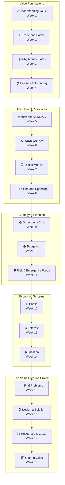

# 18-Week Financial Literacy Curriculum

This curriculum provides a **structured introduction to financial literacy** for young beginners (roughly ages 8-12, with adult guidance as needed). It blends guided instruction with independent exploration to help learners develop confidence understanding **money, saving, spending, earning, and making smart financial decisions**.

The program progresses from **the mechanics of trade** through **digital money systems and strategic budgeting** into **economic systems** and culminates in an **entrepreneurship capstone project**.

Lessons are intentionally **hands-on, interest-driven, and flexible**, allowing the instructor to adapt activities based on the learner's curiosity and pace while still pushing students to **analyze, evaluate, and create**.

---

:::tip Use This Page
- Review [Curriculum Overview](#curriculum-overview) for pacing and teaching assumptions.
- Use [Program at a Glance](#program-at-a-glance) to jump to a specific week quickly.
- Open [Learning Ladder: How Skills Build Over Time](#learning-ladder-how-skills-build-over-time) to see how the course connects.
- Save [Independent Session Setup Tips](#independent-session-setup-tips) for caregiver logistics.
:::

:::info Planning Help
- Use this page as your roadmap before the course starts or whenever you need to find the right lesson quickly.
- The week-by-week table is the fastest way to jump into a teaching page.
:::

## Curriculum Overview

### Target Audience
Young beginner learners (roughly ages 7-11).
Basic reading ability is helpful, but adult guidance is expected.

### Weekly Structure
Each week contains:

- **Two guided sessions** (about 30 minutes each)
- **One independent session** (about 20 minutes)

Guided sessions introduce concepts and tools.
Independent sessions reinforce skills through creative exploration, reflection, and purposeful revision.

Across the curriculum, students are regularly asked to explain what they notice, compare possible choices, judge what works best, and create stronger next versions of their work.

### Final Project

The program culminates in **The Value Creation Project** (Weeks 15–18).

Students identify a real problem or need in their community and design a product or service that creates value. They plan a budget to manage their resources and present their project to others.

### Flexibility & Adaptability

This curriculum is a **guide, not a rigid script**.

Adjust pacing based on the learner's:

- engagement
- confidence
- curiosity
- attention span

If a concept is mastered quickly, explore optional challenges.
If a topic feels difficult, slow down and revisit it through play or discussion.

The ultimate goal is **confidence and curiosity**, not rushing through content.

---

## Program at a Glance

Each week below links to a detailed lesson page containing:

- learning objectives
- guided sessions
- independent activities
- preparation notes

| Week | Theme | Focus Highlights |
|---|---|---|
| [Week 1](./week01-understanding-value) | 💡 Understanding Value | Value is subjective — different people value different things |
| [Week 2](./week02-trade-and-barter) | 🤝 Trade and Barter | How trade works when people value things differently, and why barter has limits |
| [Week 3](./week03-why-money-exists) | 💰 Why Money Exists | Why barter breaks down and how money was invented as a shared tool |
| [Week 4](./week04-the-household-economy) | 🏠 The Household Economy | Needs vs. wants, fixed vs. flexible spending, and tradeoffs when money is limited |
| [Week 5](./week05-how-money-moves) | 💵 How Money Moves | Spending becomes earning — tracing money as it flows through a community |
| [Week 6](./week06-ways-we-pay) | 💳 Ways We Pay | Cash, cards, and digital payments — different tools for moving money |
| [Week 7](./week07-digital-money) | 💻 Digital Money | Most money exists as numbers in computer systems — how digital records track every transaction |
| [Week 8](./week08-friction-and-spending) | 🛑 Friction and Spending | The easier it is to spend money, the less carefully people think — small pauses help |
| [Week 9](./week09-opportunity-cost) | 🔀 Opportunity Cost | Every financial choice involves a tradeoff — what you gain and what you give up |
| [Week 10](./week10-budgeting) | 📊 Budgeting | Planning how money will be used before spending it |
| [Week 11](./week11-risk-and-emergency-funds) | 🛡️ Risk and Emergency Funds | Preparing for unexpected events with financial buffers |
| [Week 12](./week12-banks) | 🏦 Banks | How banks store money, keep records, and move money between accounts |
| [Week 13](./week13-interest) | 💰 Interest | How money grows when saved and costs more when borrowed |
| [Week 14](./week14-inflation) | 📉 Inflation | How rising prices change what money can buy over time |
| [Week 15](./week15-finding-problems-and-opportunities) | 🔍 Finding Problems and Opportunities | Noticing everyday problems as opportunities to create value |
| [Week 16](./week16-designing-a-solution) | 🛠️ Designing a Solution | Transforming problem observations into clear, useful product or service ideas |
| [Week 17](./week17-resources-and-costs) | 📊 Resources and Costs | Planning the time, materials, and money needed to build a project |
| [Week 18](./week18-sharing-value) | 🏆 Sharing Value | Presenting the project, exploring trade, and reflecting on the full journey |

---

## Learning Ladder: How Skills Build Over Time

Each layer of the curriculum builds on the previous one.
Students begin by understanding how value and trade work, then move into digital money systems, strategic budgeting, economic machinery, and finally producing a real entrepreneurship project.

---

## Independent Session Setup Tips

Independent sessions work best when the learner has **clear visual instructions and a structured environment**.

Helpful strategies:

**1. Visual instruction cards**
Provide simple step-by-step guidance with icons or pictures.

**2. Visual timer**
A countdown timer helps learners manage the 20-minute session independently.

**3. A simple "Help Card"**
Include common reminders and tips for the activity.

**4. Achievement tracker**
A themed progress chart with stickers or checkmarks can make progress visible and motivating.

**5. Weekly show-and-tell**
After each independent session, spend 1-2 minutes letting the learner explain what they learned or created.

---

## Final Notes

This curriculum is designed to introduce children to **financial literacy as an empowering life skill**.

By the end of the program, students will have experience with:

- the history and mechanics of trade and currency
- needs vs. wants and household budgeting
- digital money systems and how spending behavior is shaped
- budgeting, opportunity costs, and emergency planning
- banking, interest, and inflation
- entrepreneurship and value creation

Most importantly, they will build **confidence understanding money and making thoughtful financial decisions**.
